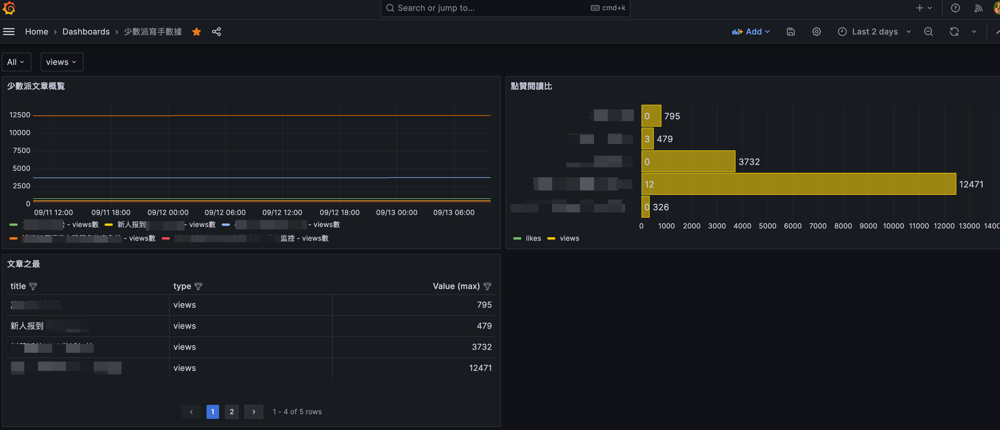

# sspai prometheus metrics

Fetching the website [少數派](https://sspai.com/) article views and likes to provider the prometheus metrics as exporter.

## Usage

### Build your own image

Go to the repo root to run the command after git clone this repo.

`docker build -t <your_tag> ./`

### Create and run your own container

1. you need to get the JWT from the website request after login `https://sspai.com` successfully
2. run the command: `docker run -it -p 3000:3000 -e SSPAI_TOKEN=<your JWT from previous step> <your_tag>`

You can check the api 'http://localhost:3000/metrics', and it's what prometheus needs.

### Prometheus pull data

[tutorial](https://prometheus.io/docs/prometheus/latest/getting_started/#configure-prometheus-to-monitor-the-sample-targets)

### Loading the grafana dashboard

Using [this file](./grafana/少數派寫手數據-1726189795818.json) to load the grafana dashboard.

## Demo

You could see the dashboard like below:

